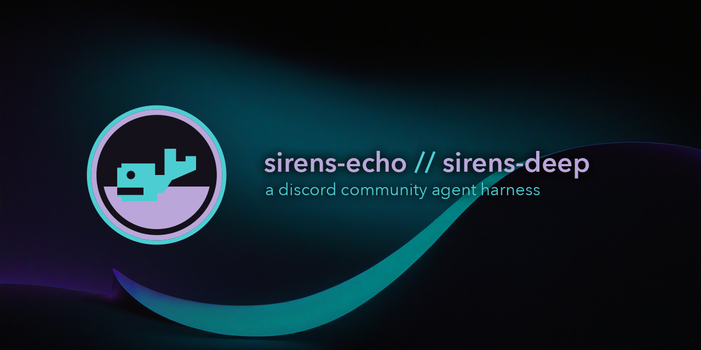

# sirens-echo



A discord community agent harness - home of sirens echo and sirens deep

## About

Sirens Echo is an automated community response service. Its model context is a
repository-owned neutral profile plus approved Sirens knowledge. The Discord
deployment remains Sirens Echo.

- Only a mention or reply in a configured channel, or a thread under one,
  invokes the service. Everything else is ignored, direct messages included.
- A git-tracked access policy stacks guild, channel, user, and role grants
  with a deny list. Per-user, per-guild, and global limits bound spend.
- Replies disable all mentions. Twelve earlier messages give continuity.
- A deterministic validator rejects greetings, emojis, banter, and sign-offs.
- The tool roster exposes public Eco MCP and a private, repository-fixed
  Forgejo MCP.
- Unanswered questions and corrections become sanitized Forgejo issues.
- The action surface stays repository-scoped, with no moderation or roles.

No automatic memory. Guarded investigations use
`.agents/skills/ops-social-discord/`. See [the walkthrough](docs/sirens-echo.md).

## Coilyco harness

The `sirens-deep` deployment selects `agent/sirens-deep.yaml`. Its model
identity is Sirens Deep of Coilyco and its scope is general-purpose.

- It loads only the domain-neutral `coilyco-general` policy and names no
  channel, so deployment selects Discord ingress, HTTP ingress, or both.
- It starts with no MCP, repository knowledge, issue tracker, or write surface
  while retaining the shared safety and transport bounds.
- One process serves several channels across several guilds, plus opt-in direct
  messages. See [multiple Discord contexts](docs/sirens-echo-contexts.md).

General-purpose means topic-neutral and extensible, not universally authorized.
Future tools or knowledge must be added explicitly to the tracked definition
with their own permission boundary.

## Configuration

Deploy selects the tracked YAML definition, Agent Proxy route, Discord switch,
channel and guild scope, admission limits, and instance name. Reachability of
`POST /v1/turn` is decided at the network layer by the deployment. See
[response profiles](docs/response-profiles.md),
[admission control](docs/sirens-echo-admission.md), and
[deployment](docs/deploy.md).

## Development

Run commands through Ward:

```sh
ward exec build
ward exec policy-check
ward exec test
ward exec vet
ward exec pre-commit-all
```

`ward exec eval-echo` exercises the production prompt, Agent Proxy, and static
Eco MCP roster without sending Discord messages or creating issues. Set
`OTEL_EXPORTER_OTLP_ENDPOINT` to name the evaluation target you run against.

## Deployment

Main pushes publish a full-source-SHA Echo image to Forgejo OCI.
`coilyco-bridge/deploy` owns the k3s Deployment, secrets, rollout, and
rollback. See [the rollout checks](docs/sirens-echo-rollout.md).

## See also

See [AGENTS.md](AGENTS.md), [docs/FEATURES.md](docs/FEATURES.md), [.ward/ward.yaml](.ward/ward.yaml),
[admission](docs/sirens-echo-admission.md), [access](docs/sirens-echo-access.md),
[HTTP](docs/sirens-echo-http.md), [health](docs/sirens-echo-health.md),
[notices](docs/sirens-echo-notices.md),
[identity](docs/sirens-echo-identity.md),
[role record](docs/sirens-echo-role-record.md),
[jobs](docs/sirens-echo-jobs.md),
[job lifecycle](docs/sirens-echo-jobs-lifecycle.md),
[job telemetry](docs/sirens-echo-jobs-telemetry.md),
[commands](docs/sirens-echo-commands.md),
[execution](docs/sirens-echo-execution.md),
[capability ledger](docs/harness-design-capability-ledger.md), and
[docs/deploy.md](docs/deploy.md).
Cross-reference convention from [features-release-tooling.md](docs/features-release-tooling.md), tracked by [coilysiren/agentic-os#59](https://github.com/coilyco-flight-deck/agentic-os/issues/59).
